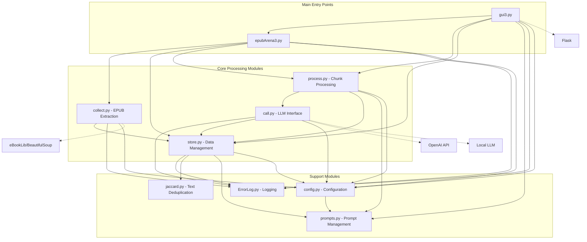

# EPUB Processing and LLM Translation Tool - Documentation

## Project Overview

This is a tool for processing EPUB files, extracting content, and using Large Language Models (LLMs) for summarization/translation. It includes a Flask web interface for managing the process.

## Architecture and Dependencies



## Module Descriptions

### **Main Entry Points**

#### `epubArena3.py` 📖
**Purpose**: Main processing pipeline for EPUB files
**Key Functions**:
- Orchestrates the entire EPUB processing workflow
- Handles batch processing of multiple EPUB files
- Manages chunk processing with configurable start/stop points
- Generates output files (HTML side-by-side view, EPUB)

**Dependencies**: `collect`, `store`, `process`, `ErrorLog`, `config`

#### `gui3.py` 🖥️
**Purpose**: Web-based user interface
**Key Features**:
- Flask-based web interface for managing EPUB processing
- Real-time progress monitoring
- Configuration management
- File upload functionality
- Prompt selection interface

**Dependencies**: `epubArena3`, `process`, `store`, `prompts`, `ErrorLog`, `config`

### **Core Processing Modules**

#### `call.py` 🤖
**Purpose**: Interface with LLM APIs
**Features**:
- Supports OpenAI API and local LLMs (via llama.cpp)
- Configurable model parameters (temperature, top_p, max_tokens)
- Fallback mechanisms for API failures
- Simulated mode for testing

**Dependencies**: `ErrorLog`, `store`, `config`

#### `collect.py` 📚
**Purpose**: EPUB file extraction and chunking
**Features**:
- Extracts chapters, images, and metadata from EPUB files
- Intelligent chunking based on paragraph/word limits
- Handles various HTML elements (headings, tables, images, lists)
- Configurable chunk sizes

**Dependencies**: `store`, `ErrorLog`, `config`

#### `process.py` ⚙️
**Purpose**: Processes chunks through LLM pipeline
**Features**:
- Iterates through chunks and sends them to LLM
- Maintains processing state
- Handles interruptions and resumes
- Automatic saving of progress

**Dependencies**: `store`, `ErrorLog`, `call`, `config`, `prompts`

#### `store.py` 💾
**Purpose**: Data structures and persistence
**Key Classes**:
- `chunk`: Represents a unit of text/content
- `translation`: Contains processed chunks with metadata
- `mainstore`: Main data container with source and translations
- `publication`: Handles output generation (HTML, EPUB)

**Dependencies**: `ErrorLog`, `jaccard`, `config`, `prompts`

### **Support Modules**

#### `config.py` ⚙️
**Purpose**: Configuration management
**Features**:
- Centralized configuration settings
- Path management (input, output, logs)
- Prompt loading/saving from JSON
- Runtime configuration updates

**Dependencies**: `prompts`

#### `prompts.py` 💬
**Purpose**: Prompt management system
**Features**:
- `promptset` class with configurable parameters
- JSON serialization/deserialization
- Prompt selection by ID
- Support for different target languages

#### `ErrorLog.py` 📋
**Purpose**: Logging system
**Features**:
- Multi-level logging (info, warning, error)
- Separate error and general logs
- File-based logging with rotation
- Console output with timestamps

#### `jaccard.py` 🧹
**Purpose**: Text deduplication
**Features**:
- Jaccard similarity-based sentence deduplication
- Language-specific processing (German/English)
- Configurable similarity thresholds
- Performance optimized

## Data Flow

1. **Input**: EPUB file uploaded via GUI or placed in `input/` directory
2. **Extraction**: `collect.py` extracts chapters and creates chunks
3. **Processing**: `process.py` sends chunks to LLM via `call.py`
4. **Storage**: Results stored in `mainstore` object via `store.py`
5. **Output**: `publication` class generates HTML/EPUB outputs
6. **Monitoring**: Real-time updates through Flask interface

## File Structure

```
project/
├── call.py          # LLM interface
├── collect.py       # EPUB extraction
├── config.py        # Configuration
├── epubArena3.py    # Main processing script
├── ErrorLog.py      # Logging
├── gui3.py          # Web interface
├── jaccard.py       # Text deduplication
├── process.py       # Chunk processing
├── prompts.py       # Prompt management
├── prompts.json     # Prompt configurations
└── store.py         # Data storage

directories/
├── input/           # EPUB input files
├── output/          # Generated HTML/EPUB files
├── pkl/             # Pickle files (processed state)
└── logs/            # Log files
```

## Configuration

### Key Configuration Settings (`config.py`):

```python
# Paths
pathinp = 'input/'     # Input EPUB files
pathout = 'output/'    # Output HTML/EPUB files
pathpkl = 'pkl/'       # State files
pathlog = 'logs/'      # Log files

# LLM Settings
default_OPENAI_API_BASE = "http://127.0.0.1:5000/v1"
default_OPENAI_API_KEY = "sk-..."
default_OPEN_API_MODELNAME = "deepseek-chat"

# Processing
chunker_maxp = 20      # Max paragraphs per chunk
chunker_maxwords = 350 # Max words per chunk
forceRedo = False      # Reprocess existing chunks
```

### Prompt Configuration (`prompts.json`):
Each prompt includes:
- `system_message`: LLM system prompt
- `prePrompt`/`postPrompt`: Text wrappers
- `allowLongAnswer`: Allow longer responses
- `temperature`/`top_p`: LLM parameters
- `targetlanguage`: Target language code

## Usage Examples

### Command Line:
```bash
python epubArena3.py
```

### Web Interface:
```bash
python gui3.py
# Access at http://127.0.0.1:8080
```

### Batch Processing:
Set `batchJobs = True` in config to process all EPUBs in `input/` directory

## External Dependencies

### Required:
```
ebooklib
beautifulsoup4
requests
flask
openai
markdown
```

### Optional:
```
llama-cpp-python  # For local LLM support
spacy             # For advanced text deduplication
keyboard          # For keyboard interrupt support
```

## Troubleshooting

### Common Issues:
1. **LLM Connection Failed**: Check API base URL and key in config
2. **EPUB Extraction Issues**: Verify EPUB file format and structure
3. **Memory Issues**: Reduce `chunker_maxwords` or use smaller chunks
4. **Processing Stops**: Check logs for LLM timeout or API errors

### Log Files:
- General logs: `logs/[epub_filename].log`
- Error logs: `logs/errors.log`

## Performance Considerations

1. **Chunk Size**: Adjust `chunker_maxwords` based on LLM context window
2. **Batch Processing**: Enable for multiple files, monitor memory usage
3. **Cache**: Processed chunks are saved in PKL files for resumption
4. **Parallel Processing**: Currently single-threaded for reliability

## Extension Points

1. **New LLM Providers**: Add to `call.py` `llmcaller` class
2. **Additional Output Formats**: Extend `publication` class in `store.py`
3. **Custom Processing**: Modify `processor` class in `process.py`
4. **New Prompt Types**: Add to `prompts.json` and select via GUI
